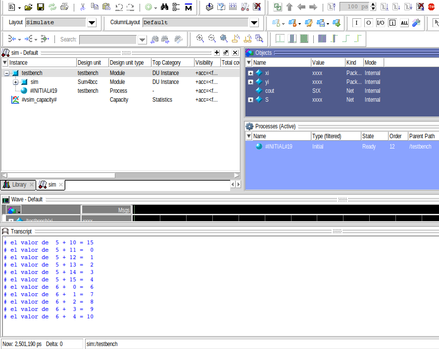

# lab02- sumador 4 bits

## Nombres de integrantes

### Diddier Alexander Hilarion Beltran
### Gabriela María Castro Beltrán
### Daniel Pineda

## Resumen
En el presente informe, se muestra la realización de un sumador de 4 bit, analizando su tabla de verdad y con ella compuertas lógicas para su desarrollo, esto se efectúo atreves de Quartus, la cual es una herramienta de software producida por Altera para el análisis y la síntesis de diseños realizados en HDL o hardware description language por sus siglas en inglés.

## Palabras claves
Verilog, tablas de verdad, compuertas lógicas, acarreo, bit, FPGA, sumador de 1 bit.

## Introdución
Con el presente informe se pretende estudiar e identificar las compuertas lógicas utilizadas para el desarrollo de un sumador de 4 bit, teniendo como objetivo la familiarización con el franwork de trabajo de la FPGA, así como comprender el lenguaje en Hardware, el cual estará dado por el lenguaje en Verilog y su simulación.

## Sumador de 4 bits

Para el dasarrollo de un sumador de 4 bit, se necesita primeramente un medio sumador de 1 bit, el cual como se muestra en la tabla 1 posee dos entradas y dos salidas, siendo S el resultado de la suma y Cout el acarreo. Este sumador se puede construir mediante una compuerta XOR y una compuerta AND.

<p align="center">  

| A | B | C_out | S |
| - | - | :---: | - |
| 0 | 0 |   0   | 0 | 
| 0 | 1 |   0   | 1 | 
| 1 | 0 |   0   | 1 | 
| 1 | 1 |   1   | 0 | 

Tabla 1. Medio sumador.
</p>

Para un sumador de n bits, Cout se traslada al siguiente bit más significativo, sin embargo el medio sumador carece de una entrada Cin. Por lo que la manera de contriurlo es encadenar n sumadores completos como se requiera, actuando el Cout de uno como el Cin del siguiente sumador. Es proceso se ilustra mejor en la siguiente Figura.


Figura 1. Diagrama del sumador de 4 bits.

## Analís del Código

### Sumador de 1 bit

Como se menciono anterior mente para el sumador de 4 bits es necesario la implementacóin individual de un sumador de 1 bit, el cual tenga tanto Cin como Cout. El sumador de un bit guarda la suma de las entradas en un registro de 2 bits donde el primero es la salida y el segundo es el Cout. 

```python
module sum1bcc (A, B, Ci,Cout,S);

  input  A;
  input  B;
  input  Ci;
  output Cout;
  output S;

  reg [1:0] st;
  assign S = st[0];
  assign Cout = st[1];

  always @ ( * ) begin
  	st  = 	A+B+Ci;
  end
  
endmodule

```

### Sumador de 4 bit

Para el sumador de 4 bits se crea las entradas y salidas como registros de 4 bits. Con esto se instancia las 4 sumas de un bit dandole como parametro el bit significativo correspondiente de las entradas y para el parametro Cin le damos como entrada el Cout del sumador anterior como se explico anterior mente. 
```python
module Sum4bcc (xi,yi,cout,S);

//Declaracion de las entradas y salidas del operador
input [3:0] xi;
input [3:0] yi;
output cout;
output [3:0] S;


//Declaracion de cables 
wire C1,C2,C3,cout2;
wire [3:0] St;
assign cout= ~cout2;
assign S= ~St;

//Sumas internas de 1 bit para obtener el resultado de la suma de 4 bits
sum1bcc S1 (.A(xi[0]),.B(yi[0]),.Ci(0),.Cout(C1),.S(St[0]));
sum1bcc S2 (.A(xi[1]),.B(yi[1]),.Ci(C1),.Cout(C2),.S(St[1]));
sum1bcc S3 (.A(xi[2]),.B(yi[2]),.Ci(C2),.Cout(C3),.S(St[2]));
sum1bcc S4 (.A(xi[3]),.B(yi[3]),.Ci(C3),.Cout(cout2),.S(St[3]));

endmodule
```

## Simulación
* Código fuente de *testbench.v* fue modificado y comentado en *Codigo_s/testbench.v*
* Se procedió a simular usando el modulo de testbench *testbench.v*.
En la salida se obtuvo el siguiente resultado
```
# el valor de  0 +  0 =  0
# el valor de  0 +  1 =  1
# el valor de  0 +  2 =  2
# el valor de  0 +  3 =  3
# el valor de  0 +  4 =  4
# el valor de  0 +  5 =  5
# el valor de  0 +  6 =  6
# el valor de  0 +  7 =  7
# el valor de  0 +  8 =  8
# el valor de  0 +  9 =  9
# el valor de  0 + 10 = 10
# el valor de  0 + 11 = 11
# el valor de  0 + 12 = 12
# el valor de  0 + 13 = 13
# el valor de  0 + 14 = 14
# el valor de  0 + 15 = 15
# el valor de  1 +  0 =  1
# el valor de  1 +  1 =  2
# el valor de  1 +  2 =  3
# el valor de  1 +  3 =  4
# el valor de  1 +  4 =  5
# el valor de  1 +  5 =  6
# el valor de  1 +  6 =  7
# el valor de  1 +  7 =  8
# el valor de  1 +  8 =  9
# el valor de  1 +  9 = 10
# el valor de  1 + 10 = 11
# el valor de  1 + 11 = 12
# el valor de  1 + 12 = 13
# el valor de  1 + 13 = 14
# el valor de  1 + 14 = 15
# el valor de  1 + 15 =  0
# el valor de  2 +  0 =  2
# el valor de  2 +  1 =  3
# el valor de  2 +  2 =  4
# el valor de  2 +  3 =  5
# el valor de  2 +  4 =  6
# el valor de  2 +  5 =  7
# el valor de  2 +  6 =  8
# el valor de  2 +  7 =  9
# el valor de  2 +  8 = 10
# el valor de  2 +  9 = 11
# el valor de  2 + 10 = 12
# el valor de  2 + 11 = 13
# el valor de  2 + 12 = 14
# el valor de  2 + 13 = 15
# el valor de  2 + 14 =  0
# el valor de  2 + 15 =  1
# el valor de  3 +  0 =  3
# el valor de  3 +  1 =  4
# el valor de  3 +  2 =  5
# el valor de  3 +  3 =  6
# el valor de  3 +  4 =  7
# el valor de  3 +  5 =  8
# el valor de  3 +  6 =  9
# el valor de  3 +  7 = 10
# el valor de  3 +  8 = 11
# el valor de  3 +  9 = 12
# el valor de  3 + 10 = 13
# el valor de  3 + 11 = 14
# el valor de  3 + 12 = 15
# el valor de  3 + 13 =  0
# el valor de  3 + 14 =  1
# el valor de  3 + 15 =  2
# el valor de  4 +  0 =  4
# el valor de  4 +  1 =  5
# el valor de  4 +  2 =  6
# el valor de  4 +  3 =  7
# el valor de  4 +  4 =  8
# el valor de  4 +  5 =  9
# el valor de  4 +  6 = 10
# el valor de  4 +  7 = 11
# el valor de  4 +  8 = 12
# el valor de  4 +  9 = 13
# el valor de  4 + 10 = 14
# el valor de  4 + 11 = 15
# el valor de  4 + 12 =  0
# el valor de  4 + 13 =  1
# el valor de  4 + 14 =  2
# el valor de  4 + 15 =  3
# el valor de  5 +  0 =  5
# el valor de  5 +  1 =  6
# el valor de  5 +  2 =  7
# el valor de  5 +  3 =  8
# el valor de  5 +  4 =  9
# el valor de  5 +  5 = 10
# el valor de  5 +  6 = 11
# el valor de  5 +  7 = 12
# el valor de  5 +  8 = 13
# el valor de  5 +  9 = 14
# el valor de  5 + 10 = 15
# el valor de  5 + 11 =  0
# el valor de  5 + 12 =  1
# el valor de  5 + 13 =  2
# el valor de  5 + 14 =  3
# el valor de  5 + 15 =  4
# el valor de  6 +  0 =  6
# el valor de  6 +  1 =  7
# el valor de  6 +  2 =  8
# el valor de  6 +  3 =  9
# el valor de  6 +  4 = 10
# el valor de  6 +  5 = 11
# el valor de  6 +  6 = 12
# el valor de  6 +  7 = 13
# el valor de  6 +  8 = 14
# el valor de  6 +  9 = 15
# el valor de  6 + 10 =  0
# el valor de  6 + 11 =  1
# el valor de  6 + 12 =  2
# el valor de  6 + 13 =  3
# el valor de  6 + 14 =  4
# el valor de  6 + 15 =  5
# el valor de  7 +  0 =  7
# el valor de  7 +  1 =  8
# el valor de  7 +  2 =  9
# el valor de  7 +  3 = 10
# el valor de  7 +  4 = 11
# el valor de  7 +  5 = 12
# el valor de  7 +  6 = 13
# el valor de  7 +  7 = 14
# el valor de  7 +  8 = 15
# el valor de  7 +  9 =  0
# el valor de  7 + 10 =  1
# el valor de  7 + 11 =  2
# el valor de  7 + 12 =  3
# el valor de  7 + 13 =  4
# el valor de  7 + 14 =  5
# el valor de  7 + 15 =  6
# el valor de  8 +  0 =  8
# el valor de  8 +  1 =  9
# el valor de  8 +  2 = 10
# el valor de  8 +  3 = 11
# el valor de  8 +  4 = 12
# el valor de  8 +  5 = 13
# el valor de  8 +  6 = 14
# el valor de  8 +  7 = 15
# el valor de  8 +  8 =  0
# el valor de  8 +  9 =  1
# el valor de  8 + 10 =  2
# el valor de  8 + 11 =  3
# el valor de  8 + 12 =  4
# el valor de  8 + 13 =  5
# el valor de  8 + 14 =  6
# el valor de  8 + 15 =  7
# el valor de  9 +  0 =  9
# el valor de  9 +  1 = 10
# el valor de  9 +  2 = 11
# el valor de  9 +  3 = 12
# el valor de  9 +  4 = 13
# el valor de  9 +  5 = 14
# el valor de  9 +  6 = 15
# el valor de  9 +  7 =  0
# el valor de  9 +  8 =  1
# el valor de  9 +  9 =  2
# el valor de  9 + 10 =  3
# el valor de  9 + 11 =  4
# el valor de  9 + 12 =  5
# el valor de  9 + 13 =  6
# el valor de  9 + 14 =  7
# el valor de  9 + 15 =  8
# el valor de 10 +  0 = 10
# el valor de 10 +  1 = 11
# el valor de 10 +  2 = 12
# el valor de 10 +  3 = 13
# el valor de 10 +  4 = 14
# el valor de 10 +  5 = 15
# el valor de 10 +  6 =  0
# el valor de 10 +  7 =  1
# el valor de 10 +  8 =  2
# el valor de 10 +  9 =  3
# el valor de 10 + 10 =  4
# el valor de 10 + 11 =  5
# el valor de 10 + 12 =  6
# el valor de 10 + 13 =  7
# el valor de 10 + 14 =  8
# el valor de 10 + 15 =  9
# el valor de 11 +  0 = 11
# el valor de 11 +  1 = 12
# el valor de 11 +  2 = 13
# el valor de 11 +  3 = 14
# el valor de 11 +  4 = 15
# el valor de 11 +  5 =  0
# el valor de 11 +  6 =  1
# el valor de 11 +  7 =  2
# el valor de 11 +  8 =  3
# el valor de 11 +  9 =  4
# el valor de 11 + 10 =  5
# el valor de 11 + 11 =  6
# el valor de 11 + 12 =  7
# el valor de 11 + 13 =  8
# el valor de 11 + 14 =  9
# el valor de 11 + 15 = 10
# el valor de 12 +  0 = 12
# el valor de 12 +  1 = 13
# el valor de 12 +  2 = 14
# el valor de 12 +  3 = 15
# el valor de 12 +  4 =  0
# el valor de 12 +  5 =  1
# el valor de 12 +  6 =  2
# el valor de 12 +  7 =  3
# el valor de 12 +  8 =  4
# el valor de 12 +  9 =  5
# el valor de 12 + 10 =  6
# el valor de 12 + 11 =  7
# el valor de 12 + 12 =  8
# el valor de 12 + 13 =  9
# el valor de 12 + 14 = 10
# el valor de 12 + 15 = 11
# el valor de 13 +  0 = 13
# el valor de 13 +  1 = 14
# el valor de 13 +  2 = 15
# el valor de 13 +  3 =  0
# el valor de 13 +  4 =  1
# el valor de 13 +  5 =  2
# el valor de 13 +  6 =  3
# el valor de 13 +  7 =  4
# el valor de 13 +  8 =  5
# el valor de 13 +  9 =  6
# el valor de 13 + 10 =  7
# el valor de 13 + 11 =  8
# el valor de 13 + 12 =  9
# el valor de 13 + 13 = 10
# el valor de 13 + 14 = 11
# el valor de 13 + 15 = 12
# el valor de 14 +  0 = 14
# el valor de 14 +  1 = 15
# el valor de 14 +  2 =  0
# el valor de 14 +  3 =  1
# el valor de 14 +  4 =  2
# el valor de 14 +  5 =  3
# el valor de 14 +  6 =  4
# el valor de 14 +  7 =  5
# el valor de 14 +  8 =  6
# el valor de 14 +  9 =  7
# el valor de 14 + 10 =  8
# el valor de 14 + 11 =  9
# el valor de 14 + 12 = 10
# el valor de 14 + 13 = 11
# el valor de 14 + 14 = 12
# el valor de 14 + 15 = 13
# el valor de 15 +  0 = 15
# el valor de 15 +  1 =  0
# el valor de 15 +  2 =  1
# el valor de 15 +  3 =  2
# el valor de 15 +  4 =  3
# el valor de 15 +  5 =  4
# el valor de 15 +  6 =  5
# el valor de 15 +  7 =  6
# el valor de 15 +  8 =  7
# el valor de 15 +  9 =  8
# el valor de 15 + 10 =  9
# el valor de 15 + 11 = 10
# el valor de 15 + 12 = 11
# el valor de 15 + 13 = 12
# el valor de 15 + 14 = 13
# el valor de 15 + 15 = 14
```


El código del testbench estaba inicialmente diseñado para iterar de manera infinita, esto debido a que se usaban registros de 4 bits para *xi* e *yi* por lo cual hay un desbordamiento antes de llegar a 16 por lo cual siempre se cumplirá la condición de iteración. En el cambio realizado se incrementó un bit a los registros sobre los cuales se iteraba con el fin de que se logrará llegar al número 16 y cumplir la condición de salida. Además se organizó de manera que se puedan usar loops anidados.



Figura 2. Simulación en *testbench* del sumador de 4 bits.

Se puede observar en los resultados que la suma entre dos números de 4 bits es un número de 4 bits y que cuando el resultado supera el 15 hay un desbordamiento por lo cual esta suma se ajusta a una aritmetica modular modulo 16. Para que el resultado sea exacto sería necesario considerar la salida como de 5 bits y usar  *cout* como el bit más significativo.
Se evidencia que a diferencia de la programación de software no es necesario llamar el modulo Sum4bcc o sum1bcc dentro del ciclo for ya que los modulos ya han sido instanciados/conectados internamente y siempre responderán a cambios en la entrada.
## Videos de funcionamiento.
En el siguiente video se puede observar el funcionamiento del sumador de 4 bits en la placa.

[](https://youtube.com/shorts/liwWXuoBbzc "Sumador")

## Conclusión 

Con descripción de hardware podemos implementar sistemas digitales mas complejos apartir de unidades digitales mas simples.

La simulación es una util herramienta para poder ver funcionamiento del hadware antes de su implementación.


## Bibliografia 
1.	Floyd. Fundamentos de Sistemas Digitales 9 Edicion. Pearson Educacion; 2007.
